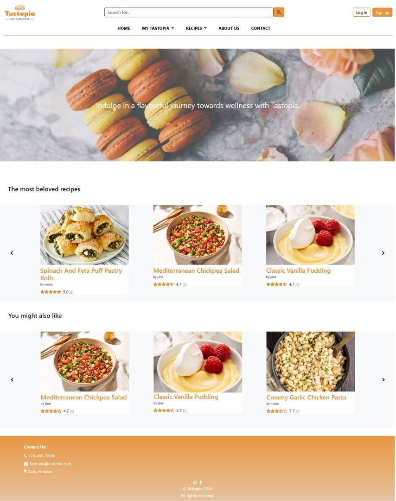
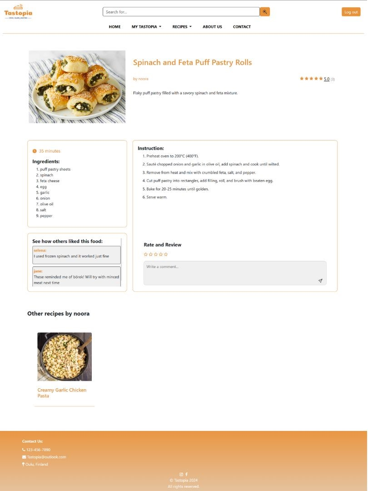
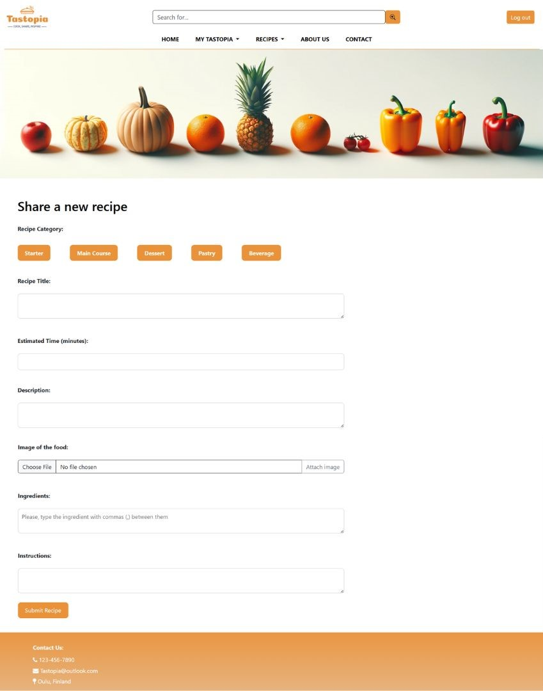

# 🍴 Tastopia – Recipe Sharing Platform

Tastopia is a vibrant recipe-sharing web application where food enthusiasts can explore, share, and interact with recipes. It connects food lovers by enabling them to post their own recipes, rate and review others, and discover new culinary favorites.

---

## 📸 Screenshots

### 🌟 Homepage
Showcases **Most Beloved Recipes** (highest-rated) and a **You Might Also Like** section with personalized suggestions.

<div align="center">
  
</div>

---

### 📖 Recipe Details Page
Dive into full recipe details, including ingredients, steps, and cooking time. Registered users can:
- ⭐ **Rate recipes**
- 💬 **Add reviews**

<div align="center">
  
</div>

---

### ✍️ Recipe Sharing Page
Registered users can submit their own recipes with fields for:
- **Title**
- **Ingredients**
- **Instructions**
- **Image upload**

<div align="center">
  
</div>

---

## 🔑 User Permissions

| User Type            | Permissions                                             |
|----------------------|---------------------------------------------------------|
| **Guest Users**      | Browse recipes, view ratings & comments                 |
| **Registered Users** | Share new recipes, rate existing recipes, write reviews |

---

## ⚙️ Tech Stack

| **Frontend**         | **Backend**       | **Database**                  | **Authentication**    |
|----------------------|-------------------|-------------------------------|-----------------------|
| HTML, CSS, Bootstrap | Node.js + Express | PostgreSQL with Sequelize ORM | JWT (JSON Web Tokens) |

---

## 🚀 Features

- 🔍 **Search & Browse:** Explore recipes by category or search by title and ingredients.
- ✨ **Interactive Features:** Share, rate, and review recipes (registered users only).
- 🏠 **Personalized Suggestions:** Tailored recommendations on the homepage.
- 📱 **Responsive Design:** Seamless browsing on any device.

---

## 🛠️ Installation & Setup

### 1️⃣ Clone the repository:
```bash
git clone https://github.com/suheda-snr/tastopia.git
cd tastopia
```

### 2️⃣ Install dependencies:
```bash
npm install
```

### 3️⃣ Set up environment variables:
Create a `.env` file in the root directory and add the following variables:
```env
DB_USER=<your-database-username>
DB_PASSWORD=<your-database-password>
DB_HOST=<your-database-host>
DB_PORT=<your-database-port>
DB_NAME=<your-database-name>
SESSION_SECRET=<your-session-secret>
PORT=<your-application-port>
```

### 4️⃣ Initialize the database:
Ensure PostgreSQL is running, then initialize the database.

### 5️⃣ Start the application:
```bash
node server/index.js
```

### 6️⃣ Access the application:
Open your browser and navigate to [http://localhost:3001](http://localhost:3001) to start using Tastopia.

---